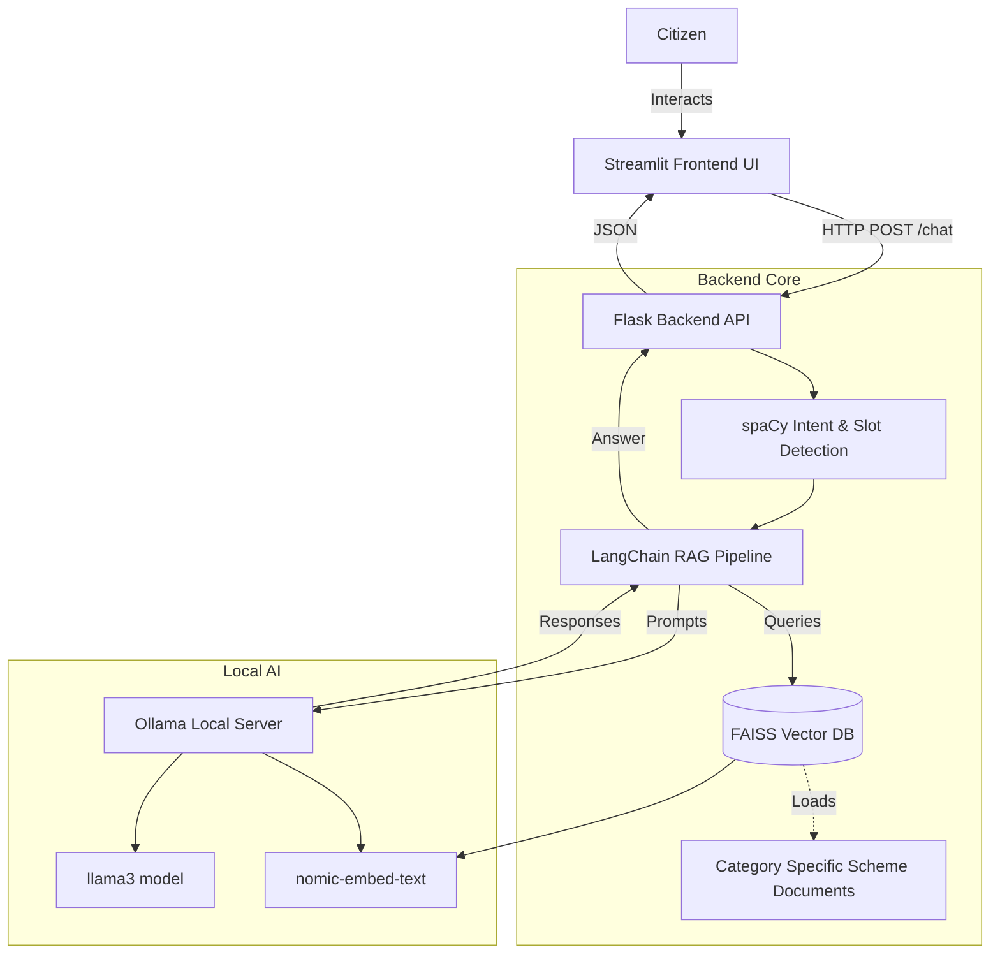

# 🏛️ Citizen Services Assistant

A comprehensive, locally-run web application designed to help citizens navigate government services and schemes. This project features a modern dashboard with clickable service categories and an embedded, context-aware AI chatbot that guides users step-by-step through eligibility requirements and application processes.

---

## ✨ Features

- **Modern UI/UX**: A beautiful, highly accessible dashboard built with Streamlit and custom CSS, featuring interactive service tiles and a floating chat interface.
- **Context-Aware Chat**: The AI assistant automatically knows which service category you are looking at and scopes its knowledge accordingly.
- **Local AI & Privacy**: Powered entirely by local models via Ollama. No citizen data is sent to external APIs like OpenAI.
- **RAG Architecture**: Uses Retrieval-Augmented Generation with FAISS vector databases to ensure the chatbot grounds its answers in actual government scheme documents.
- **NLP Intent Detection**: Uses spaCy for lightweight, fast intent detection and slot filling before falling back to the heavy LLM.

---

## 🏗️ System Architecture



---

## 💻 Tech Stack

### Frontend
- **Framework**: [Streamlit](https://streamlit.io/)
- **Styling**: Extensive custom Vanilla CSS injected via Markdown for modern, responsive card layouts and animations.

### Backend API
- **Framework**: [Flask](https://flask.palletsprojects.com/) & Flask-CORS

### AI & Natural Language Processing
- **Orchestration**: [LangChain](https://python.langchain.com/)
- **Local LLM Server**: [Ollama](https://ollama.ai/)
- **LLM Model**: `llama3`
- **Embedding Model**: `nomic-embed-text`
- **Vector Database**: [FAISS](https://faiss.ai/) (faiss-cpu)
- **NLP Engine**: [spaCy](https://spacy.io/) (`en_core_web_sm` model)

---

## 🚀 Setup Instructions

### Prerequisites
1. **Python 3.9+** installed on your system.
2. **Ollama** installed locally. Download from [ollama.ai](https://ollama.ai/).

### 1. Start Ollama and Pull Models
Ensure the Ollama application is running in the background, then open a terminal and pull the required models:
```bash
ollama pull llama3
ollama pull nomic-embed-text
```

### 2. Setup Python Environment
Create a virtual environment and install the required dependencies:
```bash
python -m venv venv
```

Activate the virtual environment:
- **Windows**: `.\venv\Scripts\activate`
- **Mac/Linux**: `source venv/bin/activate`

Install dependencies and the spaCy model:
```bash
pip install -r requirements.txt
python -m spacy download en_core_web_sm
```

### 3. Build Vector Databases
Before running the app, you need to embed the government scheme documents into FAISS vector indexes:
```bash
python scripts/build_all_indexes.py
```

---

## 🏃‍♂️ Running the Application

### The Easy Way (Windows)
If you are on Windows, you can use the provided startup script which automatically handles the virtual environment and starts both the frontend and backend servers, while preventing encoding errors:
```powershell
.\run.ps1
```

### Manual Startup (Any OS)
You will need two separate terminal windows (ensure your `venv` is activated in both).

**Terminal 1: Start the Backend API**
```bash
# On Windows, force UTF-8 to prevent emoji crash
$env:PYTHONUTF8=1
python -m app.main
```
*(Runs on http://localhost:5000)*

**Terminal 2: Start the Frontend UI**
```bash
streamlit run ui/streamlit_app.py
```
*(Runs on http://localhost:8501)*

---

## 📁 Project Structure

```text
citizen-services-assistant/
├── app/
│   ├── main.py              # Flask application and API routes
│   ├── catalog.py           # Service category definitions
│   ├── llm/                 # LangChain configurations and RAG logic
│   └── nlp/                 # spaCy intent and slot detection
├── data/
│   └── schemes/             # Text documents describing government schemes
├── faiss_indexes/           # Generated vector databases (created by script)
├── scripts/
│   └── build_all_indexes.py # Script to convert /data into /faiss_indexes
├── ui/
│   └── streamlit_app.py     # Streamlit frontend application
├── .streamlit/
│   └── config.toml          # Enforces Light Mode theme for Streamlit
├── requirements.txt         # Python dependencies
└── run.ps1                  # Windows startup script
```
